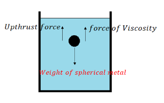
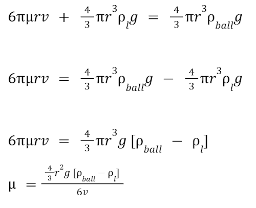

Viscosity is a measure of a fluid's resistance to flow. It describes how much a fluid resists deformation when subjected to an external force. In simple terms, it determines how "thick" or "thin" a fluid is. Viscosity arises due to internal friction between layers of a fluid moving at different speeds. A more viscous liquid exerts a greater resistive force on objects moving through it.

Stokes method is used to determine the coefficient of viscosity (μ) of a liquid by studying how a sphere moves through it. The movement of the sphere is affected by three forces:

- Gravity (Weight of the Sphere, W) – Pulls the sphere downward.
- Upthrust Force (Buoyant Force, Fupthrust) – Acts upward due to the displaced liquid, as per Archimedes' principle. Fupthrust = Weight of the displaced liquid
- Viscous Force (Fviscosity​) – Opposes the motion of the sphere, resisting its fall through the liquid.

As the sphere falls through a viscous liquid. Initially, the sphere accelerates due to gravity, but the resistive forces (viscous force and upthrust) increase as it gains speed. Eventually, these forces balance the sphere's weight, causing it to move at a constant velocity — this is called terminal velocity (v).
At terminal velocity, the forces balance out, meaning:

Total upward force = downward force

∴ Force of viscosity + upthrust force = weight of metal sphere

6πμrv + weight of the displaced liquid = weight of the metal sphere

6πμrv + mass of the displaced liquid × g = [ mass of the metal sphere × g ]

∴ 6πμrv + volume of the displaced liquid × Density of the liquid × g = volume of the metal sphere × density of the metal sphere × g

&mu; ⟹ Viscosity of the liquid ( SI unit: Ns/m2 )  
r ⟹ radius of the metal sphere ( SI unit: m )  
g ⟹ Acceleration due to gravity ( SI unit: m/s2 )  
ball ⟹ Density of the metal sphere ( SI unit: kg/m3 )  
l ⟹ density of the liquid ( SI unit: kg/m3 )  
v ⟹ Terminal Velocity ( SI unit: m/s )

